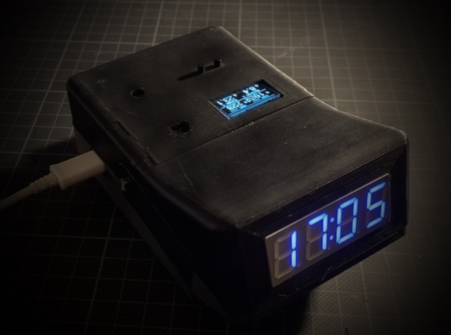
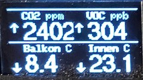

## Sensorclock with 7 segment leds and multiple Home assistant integrated sensors.

This example shows a clock with 7-segment display that contains the following sensors:

- DHT22 (temperature, humidity)
- BMP085 (temperature, pressure, can be recplaced by BMP180)
- CCS811 (CO2, TVOC)
- TSL2561 (light intensity, used to control the brightness of the display)

The clock uses NTP to get the time and date. The time is displayed in 24 hour format.
All sensor readings are exported to Home Assistant via MQTT.

An additional OLED display is used to show the current sensor readings.

## Customization

The files `net-default.json` and `mqtt-default.json` need to be copied to `net.json` and `mqtt.json` and customized to your needs.

The file `display.json` contains the data sources for the display. Please checkout the project mupplet-display/mup_gfx_panel for more information.

## Documentation

* [muwerk scheduler and messaging](https://github.com/muwerk/muwerk)
* [munet networking and mqtt](https://github.com/muwerk/munet)
* [documentation of hardware mupplets and supported MQTT messages](https://github.com/muwerk/mupplets)
* [Home Assistant's auto-discovery for MQTT](https://www.home-assistant.io/docs/mqtt/discovery/)